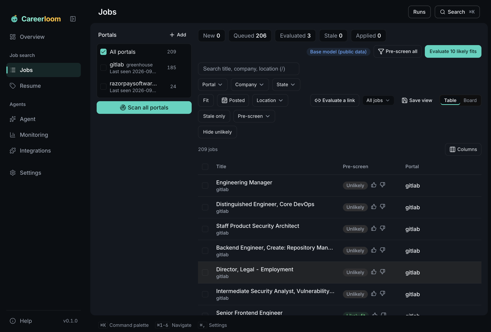
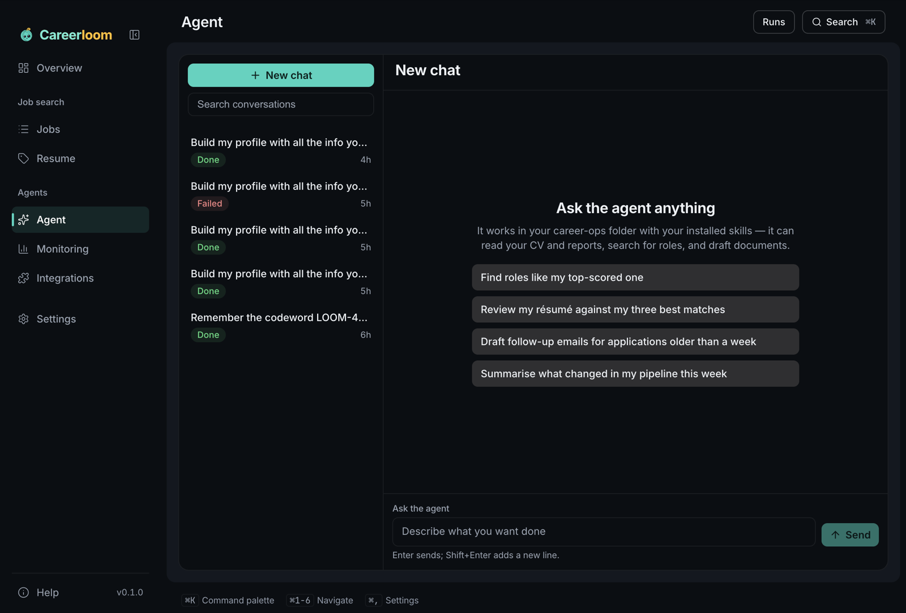
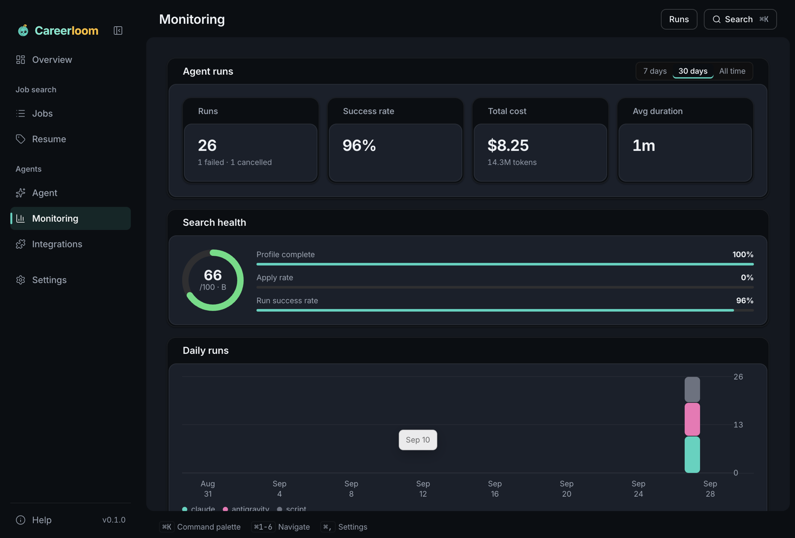
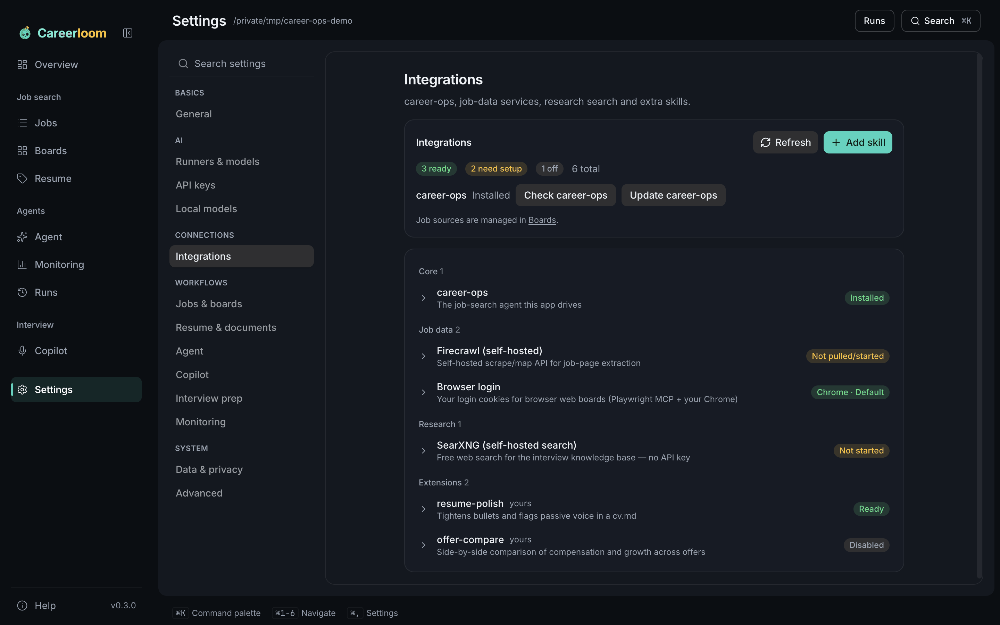

<p align="center">
  <picture>
    <source media="(prefers-color-scheme: dark)" srcset="build/brand/logo-horizontal-dark.svg">
    
  </picture>
</p>

<p align="center">
  A desktop job-search engine: find roles, screen them, evaluate the good ones and tailor your résumé —
  with an AI agent running on your own machine.
</p>

<p align="center">
  <a href="LICENSE"></a>
  
  
</p>

<p align="center"></p>

## What it does

Careerloom is a desktop interface for [career-ops](https://github.com/career-ops-hq/career-ops), the open-source
job-search agent toolkit. It drives an agent CLI you already have (OpenCode's runs free models with no account), or its own built-in agent
on an API key, and turns
career-ops' files and scripts into a visual workflow.

- **Jobs** — scan company boards (Greenhouse, Ashby, Lever, Workday and more), browse every listing across portals
  with multi-select filters, saved views, a table or board, and bulk actions.
- **Boards** — start from an India starter pack of 24 popular job boards grouped into Common, Tech, Finance and
  Consulting (each off until you enable it), then add your own.
- **Any job board** — add any listing URL. Careerloom extracts jobs with a self-hosted
  [Firecrawl](https://github.com/firecrawl/firecrawl), structured data where the page provides it, or the agent
  as a fallback. Login-walled boards can be read in a browser with your own session (opt-in, read-only).
- **Pre-screen** — before paying for full evaluations, jobs are sorted into *likely*, *needs agent* and
  *unlikely* by location, function and seniority rules, then by a small local model trained on public
  occupation data. Your 👍/👎 marks personalise it, but only when they measurably help.
- **Evaluate** — score selected jobs against your profile with career-ops' own evaluation worker, one job at a
  time, and re-evaluate when your résumé changes.
- **Résumé** — import a PDF or document, extract it into your profile, research your public links, check
  ATS-readability, and export with live PDF previews of templates.
- **Agent** — a chat for anything outside the fixed flows, with streamed tool steps and resumable threads.
- **Monitoring** — runs, success rate, cost and token usage, and the health of your search.
- **Integrations** — job sources, skills, career-ops plugins and services in one place.

| | |
|---|---|
|  |  |
|  | |

## Supported agents

| Runner | How it runs |
|---|---|
| Claude Code | `claude` CLI, headless, streamed |
| Codex | `codex exec` |
| Antigravity | `agy`, sandboxed project with scoped permissions |
| OpenCode | `opencode run`, headless, streamed; free models with no key, paid ones with an OpenCode Zen key |
| OpenCode Zen | Careerloom's built-in agent on the [OpenCode Zen](https://opencode.ai/docs/zen/) API — nothing to install; paid models with a Zen API key (free models run through the OpenCode CLI) |
| API key | Any model through [OpenRouter](https://openrouter.ai) |

Pick a runner and a model per runner in **Settings**. Careerloom checks each CLI's install and sign-in status
when you choose your career-ops folder.

## Install

Download the latest build from [Releases](https://github.com/livelong99/careerloom/releases):

- **macOS** — `Careerloom-<version>-arm64.dmg` (Apple Silicon) or `-x64.dmg` (Intel)
- **Windows** — `Careerloom-Setup-<version>.exe` (x64 and ARM64)

Builds are not code-signed yet. On macOS, right-click the app and choose **Open** the first time; on Windows,
choose **More info → Run anyway** in SmartScreen.

### Requirements

- [Node.js](https://nodejs.org) 18 or newer and [Git](https://git-scm.com)
- One agent CLI from the table above, an OpenCode Zen API key, or an OpenRouter API key
- Optional: [Docker](https://www.docker.com) for self-hosted Firecrawl
- Optional: Python 3.10 or newer for the local pre-screen model (installed from onboarding, about 1.4 GB)

The first launch walks you through tools, your career-ops folder (existing, or a fresh install), the agent,
the optional local model and your résumé.

## Development

```bash
git clone https://github.com/livelong99/careerloom.git
cd careerloom
npm install
npm run dev          # Vite + Electron with hot reload
```

| Command | What it does |
|---|---|
| `npm run typecheck` | TypeScript checks for the renderer and the main process |
| `npm test` | Unit tests (Vitest) |
| `npm run build` | Compile the main process and bundle the renderer |
| `npm run package:mac` | Build `.dmg` and `.zip` for Apple Silicon and Intel |
| `npm run package:win` | Build the NSIS installer for x64 and ARM64 |

### Project layout

```
electron/      Main process: IPC handlers, runners, career-ops bridge, integrations, pre-screen
renderer/      React UI: sections (screens), components, hooks, styles
build/         App icons and brand assets
docs/          Screenshots
```

The renderer is sandboxed with context isolation; everything reaches the main process through a typed preload
bridge (`window.careerloom`), and every IPC argument is validated in the main process.

## Privacy

Careerloom runs locally. Your résumé, profile and job data stay in your career-ops folder. Job titles are
pre-screened on your machine. Content is sent only to the agent or model provider you choose, and to job boards
you ask it to read. API keys are stored in the operating system's secure storage. Some free models may use
prompts for training — check the provider's terms before sending your résumé, and pick a zero-retention model
if that matters to you.

Browser-based boards are off by default, require a per-site acknowledgement, use only that site's cookies, and
the agent has no click, type or form tools. Many job sites prohibit automated access in their terms — use this
feature only on your own account, at a low rate, and at your own risk.

## License

[MIT](LICENSE). Careerloom builds on other open-source work — see
[THIRD_PARTY_NOTICES.md](THIRD_PARTY_NOTICES.md).
